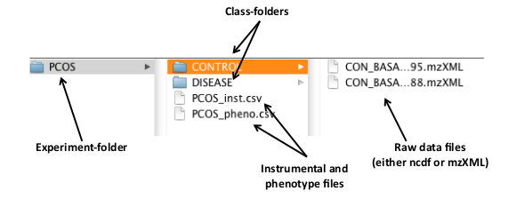
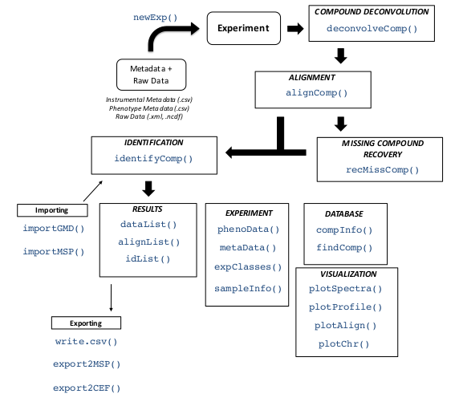

```{r setup, include = FALSE}
knitr::opts_chunk$set(
  collapse = TRUE,
  comment = "#>",
  fig.align = 'center'
)
```

This vignette presents **eRah**, an R package with an integrated design that allows for an innovative deconvolution of GC–MS chromatograms using multivariate techniques based on blind source separation (BSS), alignment of spectra across samples, and automatic identification of metabolites by spectral library matching. 
**eRah** outputs a table with compound names, matching scores and the area of the compound for each sample. 
**eRah** is designed in an open-structure, where researchers can integrate different algorithms for each step of the pipeline, i.e., compound deconvolution, alignment, identification or statistical analysis. 
**eRah** has been tested with GC-TOF/MS and GC-qTOF/MS (using nominal mass) equipment, and is compatible with different spectral databases.

Here, we integrate the downloadable version of the MassBank spectral library for an straightforward identification. 
If you use the package eRah in your analysis and publications please cite @domingo2015 and @domingo2016.
@domingo2016 is also referred for a more technical and detailed explanation about the eRah
methods.

####Installation

**eRah** can be installed from any **CRAN** repository, by:

```{r install,eval=FALSE}
install.packages("erah")
```

Then loaded using:

```{r load}
library(erah)
```

####Support
Any enquiries, bug reports or suggestions are welcome and they should be addressed to xavier.domingo@urv.cat.

##Introduction

**eRah** automatically detects and deconvolves the spectra of the compounds appearing in GC–MS chromatograms. 
**eRah** processes the raw data files (netCDF or mzXML) of a complete metabolomics experiment in an automated manner.

After that, compounds are aligned by spectral similarity and retention time distance. 
**eRah** computes the Euclidean distance between retention time distance and spectral similarity for all compounds in the chromatograms, resulting in compounds appearing across the maximum number of samples and with the least retention time and spectral distance.

Also, an (optional) missing compound recovery step, can be applied to recover those compounds that are missing in some samples. 
Missing compounds appear as a result of an incorrect deconvolution or alignment - due to a low compound concentration in a sample - , or because it is not present in the sample. This forces the final data table with compound names and compounds area, to not have any missing (zero) values.

Finally, identification of the found metabolites is conducted. 
A mean spectra from each group of aligned compounds is compared with a reference library. 
**eRah** includes a custom version of MassBank repository. Other libraries can imported with eRah (e.g., Golm Metabolome Database), and eRah’s deconvolved spectra can be exported for further comparison with NIST library.

##GC–MS Data Processing with eRah: a tutorial

In this section we show the processing of serum samples analyzed through GC–MS, and freely available from MetaboLights (accession number: MTBLS321). 

```{r loadData}
library(gcspikelite)
data("targets")
```

This tutorial shows how to deconvolve, align and identify the compounds contained in these four samples.
All the listed commands (script) to reproduce the following demo can by found by executing:

```{r help,eval=FALSE}
library(erah)
help(package = "erah")
```

and then click on User guides, package vignettes and other documentation and on source from
the ’eRah Manual’.

###Creating a new experiment

In the given example, we process only four serum chromatograms, divided into two classes: CONTROL and DISEASE. 
The experiment has to been organized as follows: all the samples related to each class have to be stored in the same folder (one folder = one class), and all the class-folders in one folder, which is the experiment folder (Figure 1). 
eRah also accepts only one class; in that case, only one class-folder has to be created inside an experiment-folder.

Here in the demo, the experiment folder is the ’PCOS’ folder, which contains two class-folders called ’CONTROL’ and ’DISEASE’ (Figure 1). This experiment has two classes. 
Here, we used the following control samples: CON BASA 567795.mzXML, and CON BASA 574488.mzXML, and the following disease samples: DIA BASE 630974.mzXML and DIA BASE 635799.mzXML. 
The user can download the same, others, or all the experiment samples.

```{r classFolders,fig.cap='**Figure 1:** Distribution of the raw data files and the class and experiment folders for the given example.',echo=FALSE}

```

To create a new experiment we have to create first a .csv type file containing the name of the raw data files to process. 
The raw data files have to be in the same directory as the instrumental file.
**eRah** also admits a phenotypic table which contains the classes of the samples. 
The instrumental data file is always needed but the phenotype file is optional. 
The instrumental table can have as many columns as desired, but it has to contain at least two columns named ’sampleID’ and ’filename’. 
The same is applicable to the phenotypic table, in this case the two necessary columns are ’sampleID’ and ’class’. 
Please note that capital letters of the column names must be respected and that ’sampleID’ is the column that relates the instrumental and phenotypic tables. 
These files can also be created automatically, execute the following command:

```{r createdt,eval=FALSE}
createdt('experiment_path/PCOS/')
```

Where `experiment_path` is the path where the experiment-folder is, and PCOS is the experiment-folder.
Two things have to be considered at this step: .csv files are different when created by American and European computers, so errors may raise due to that fact. 
Also, the folder contain-ing the samples (in this case, the folder ’PCOS’, must contain only folders. 
If the folder ’PCOS’ contains files (for example, already created .csv files), eRah will prompt an error.

* Note that if you have an specific question about a function, you can always access to the help of the function with a question mark before the name of the function: `?createdt`

Next, we load the new experiment to the R workspace using the function newExp, where we introduce the path of the .csv file containing the instrumental data and the phenotypic data, along with a description of the experiment. We name the new experiment as ’ex’. 
With metaData, phenoData and expClasses we can retrieve the instrumental data and the experiment classes and the processing status:

```{r files}
files <- list.files(system.file('data',package = 'gcspikelite'),full.names = TRUE)
files <- files[sapply(files,grepl,pattern = 'CDF')]
```

```{r dataTables}
instrumental <- createInstrumentalTable(files)

phenotype <- createPhenoTable(files, cls = as.character(targets$Group[order(targets$FileName)]))
```

```{r newExp}
ex <- newExp(instrumental = instrumental,
             phenotype = phenotype, 
             info = "DEMO Experiment")
```

```{r metaData}
metaData(ex)
```

```{r phenoData}
phenoData(ex)
```

```{r expClasses}
# expClasses(ex)
```

###Compound deconvolution

The compounds in data are deconvolved with deconvolveComp function. This function needs a
`Deconvolution parameters` object, that can be created with `setDecPar` function, containing the
parameters of the algorithm as shown as follows:

```{r deconvolve}
ex.dec.par <- setDecPar(min.peak.width = 1,avoid.processing.mz = c(35:69,73:75,147:149))

ex <- deconvolveComp(ex, ex.dec.par )
```

The peak width value (in seconds) is a critical parameter that conditions the efficiency of eRah, and also the masses to exclude have an important role in GC–MS-based metabolomics experiments.

* **Peak width parameter:** typically, this value should be the less than half of the mean compound width. For this experiment, the average peak width is between 2 and 2.5 seconds, so we selected 1 second peak width. 
The lower this parameter is set to, the more sensibility to deconvolve co-eluted compounds, but it also may increase the number of false positive compounds. 
If is set too low the algorithm will generate too false positives compounds, which this usually means that one single compound will be detected twice.
If the parameter value is increased, the algorithm may fail in separate co-eluted compounds, leading to generate less false positives but loosing capacity of detection.

Data can be saved and loaded at any stage of the process by:

```{r,eval=FALSE}
save(ex, file = "testPCOS.rda")
# Load
load("testPCOS.rda")
```

* **Masses to exclude:** masses m/z 73, 74, 75, 147, 148, 149 are recomended to be excluded in the processing and subsequent steps, since these are ubiquitous mass fragments typically generated from compounds carrying a trimethylsilyl moiety.
If the samples have ben derivatized, including these masses will only hamper the deconvolution process; this is because an important number of compounds will share these masses leading to a poorer selectivity between compounds.
Also, in GC–MS-based metabolomics samples, we also recommend excluding all masses from 1 to 69 Da, for the same reasons. Those masses are generated from compounds with groups that are very common for a large number of compounds in metabolomics, leading to a poorer selectivity between compounds. 
Although those masses are also the most intense m/z in the compounds spectra, eRah will automatically set the used library’s masses to zero, so it does not affect spectral matching and identification.

###Alignment

Alignment is executed with alignComp function. The parameters have to be also previously set.

```{r,eval=F}
ex.al.par <- setAlPar(min.spectra.cor = 0.90, max.time.dist = 3, mz.range = 70:600)

ex <- alignComp(ex, alParameters = ex.al.par)
```

The parameters are min.spectra.cor, max.time.dist and mz.range. 
The min.spectra.cor (Minimum spectral correlation) value - from 0 (non similar) to 1 (very similar) - sets how similar two or more compounds have be to be considered for alignment between them. 
We can be restrictive with this parameter, as if one compound is not detected in some samples, we can retrieve it later
by the ’missing compound recovery’ step. 
Also, we impose a maximum disalignment distance of 3 seconds (max.time.dist). 
This value (in seconds) sets how far two or more compounds can be considered for alignment between them. 
Mz.range is the range of masses that is considered when comparing spectra. 
We set that only the masses from 70 to 600 are taken into account, for the reasons commented above in the ’Masses to exclude’ point.
We can decide to execute the missing compound recovery step (and retrieve the compounds that have missing values - have not been found - in certain samples) or also identify the compounds without applying the MissRecComp function. 
In other words, the missing compound recovery step is optional.
Here, we apply the missing recovery step to later identify the compounds.

* **Aligning large ammout of samples:** For experiments containing more than 100 (Windows) or 1000 (Mac or Linux) samples, alignment could lead to errors or show a poor run-time performance. 
In those cases alignment can be conducted by block segmentation. 
For more details access to the alignComp help through `?alignComp`

###Missing compound recovery

The missing compound recovery step only requires to indicate the number of minimum values for which a compound wants to be ’re-searched’ in the samples. 
If a compound appears in at least the same or more samples than the minimum samples value (min.samples), then, this compound is searched in the rest of the samples where its concentration has not been registered. 
To do so:

```{r,eval=FALSE}
ex <- recMissComp(ex, min.samples = 3)
```

* **Missing compound recovery:** The min.samples parameter sets the number of samples from the total number of samples.
Also, this parameter should be large, in alignment with the dimension of the number of samples in the experiment. 
If set too low, a higher number of false positives are expected. 
A recommended strategy is to first evaluate the average number of samples where the compounds appear, by execut-
ing alignList or idList - after being identified - functions (explained in the following sections). 
**Warning:** if we have already identified the compounds, we always have to re-identify the compounds after executing the missing compound recovery step, by identifyComp, as explained in the following sections.

###Identification

The final processing step is to identify the previously aligned compounds and assign them a putative name. 
**eRah** compares all the spectra found against a reference database. 
This package includes a custom version of the MassBank MS library, which is selected as default database for all the functions. 
However, we strongly encourage the use of the Golm Metabolome Database (GMD). 
GMD importation is described in following sections.

Identification can be executed by identifyComp, and accessed by idList as follows:

```{r,eval=FALSE}
ex <- identifyComp(ex)

id.list <- idList(ex)
head(id.list[,1:4], n = 8)
```

###Results and visualization

Now, we can access to the identification list, alignment list and final list by idList, alignList and dataList respectively. 
From the idList(ex), we see that urea is appearing at minute 8.13 with an AlignID number #41. Let us have a look to its profile with the function plotProfile:

* Execute `?alignList`, to access to the help of alignList function with a detailed
explanation of each column in an align list.

```{r plotProfile,fig.cap='**Figure 2:** Image from `plotProfile(ex,41)`.',eval=FALSE}
plotProfile(ex, 41)
```

This displays Figure 2. Its spectra can be also be plotted and compared with the reference spectra using the function plotSprectra, which displays Figure 3:

```{r plotSpectra,fig.cap='**Figure 3:** Image from `plotSpectra(ex,41)`.',eval=FALSE}
plotSpectra(ex, 41)
```

The plotSpectra function has a lot of possibilities for plotting, to know more access to its particular help by executing `?plotSpectra`.
For example, eRah allows a rapid assessment for visualizing the second hit returned in the case of compound align ID #41 (Urea).
To do so:

```{r matchFactor,fig.cap='**Figure 4:** Image from `plotSpectra(ex,41, 2, draw.color=’orange3’)`.',eval=FALSE}
plotSpectra(ex, 41, 2, draw.color = "orange")
```

This plots Figure 4, which is a comparison of the empirical spectrum found, with the second most similar metabolite from the database (in this case Homocitrulline).
From the figure, it is clear that eRah returned the first hit correctly, as this spectra is more similar to Urea than to Homocitrulline.

##Importing and customizing mass spectral libraries

###Using the Golm Metabolome Database

Users may import their own mass spectral libraries. We strongly recommend using the Golm Metabolome Database (GMD) with eRah.
To use the GMD, first, we have to download it from its [webpage](http://gmd.mpimp-golm.mpg.de/download/), by downloading the file ”GMD 20111121 VAR5 ALK MSP.txt” or ”GMD 20111121 MDN35 ALK MSP.txt”, depending on which type of chromatographic columns (VAR5 or MDN35) are we using.
If you are not interested in using any retention index information, then both files can be used indistinctly. 
Then, we can load the library with the function
`importMSP()`:

```{r,eval=FALSE}
g.info <- "
GOLM Metabolome Database
------------------------
Kopka, J., Schauer, N., Krueger, S., Birkemeyer, C., Usadel, B., Bergmuller, E., Dor-
mann, P., Weckwerth, W., Gibon, Y., Stitt, M., Willmitzer, L., Fernie, A.R. and Stein-
hauser, D. (2005) GMD.CSB.DB: the Golm Metabolome Database, Bioinformatics, 21, 1635-
1638."

golm.database <- importGMD(filename="GMD_20111121_VAR5_ALK_MSP.txt", 
                           DB.name="GMD", 
                           DB.version="GMD_20111121", 
                           DB.info= g.info,type="VAR5.ALK")

# The library in R format can now be stored for a posterior faster loading
save(golm.database, file= "golmdatabase.rda")
```

We can substitute the default eRah database object `mslib`, for our custom database, by the following code:

```{r,eval=FALSE}
load("golmdatabase.rda")
mslib <- golm.database
```

This allows executing all the functions without the need of always setting the library parameter.
If we do not replace the `mslib` object as shown before, we have to use the new library (in this case `golm.database`) in all the functions, for example:

```{r,eval=FALSE}
findComp(name = "phenol", id.database = golm.database)
```

###Using in-house libraries

Other MSP-formatted libraries can be also imported. The procedure is the same as for the GMD database, with the only exception is that the function is `importMSP` instead of `importGMD`. 
Access to specific `importMSP` help in R (`?importMSP`) for details on database MSP input format.

##Exporting spectra: comparison with NIST

Users may export their results to MSP format or CEF format for comparison with NIST MS Search software (MSP), or to compare spectra with NIST through the MassHunter workstation (CEF). 
Users are referred to `exportMSP` and `exportCEF` functions help for more details.

##Final Summary
To complement the given tutorial, the user may access to the particular help for each function, as shown before. 
Also, and for more details, please read the original article.
Here, we show a figure (Figure 5) with all the available functions.

```{r fig.cap='**Figure 5:** **eRah** summary of functions.',echo=FALSE}

```

##Citations